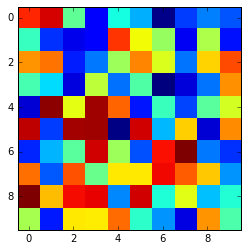
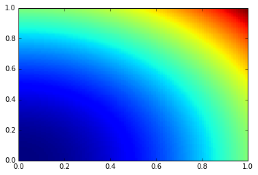

~~~
%matplotlib inline
import matplotlib.pyplot as plt
import numpy as np
~~~
{: .python}

## Construction/Arithmetic

~~~
# Array sequences
array_sequence = np.array([1, 0, 0])
array_multi = np.array([[1, 0],[0, 1]])
array_multi2 = np.array([[[1, 2], [3, 4]], [[5, 6], [7, 8]]])
array_complex = np.array([1 + 0j, 2, 3 + 1j])

# shape attribute 
array_multi.shape

# Buncha random values
this_random = np.random.random(20)

# Linear space
this_arange = np.arange(0, 1, 0.05) # Does not include endpoint
this_linspace = np.linspace(0, 1, 21) # Does include endpoint
this_logspace = np.logspace(0, 1, 21)

# Element-wise arithmetic
this_linspace + 2
this_linspace ** 2

this_linspace + this_logspace
#this_arange + this_linspace - Different shapes produce error
~~~
{: .python}

~~~
array([  1.        ,   1.17201845,   1.35892541,   1.56253754,
         1.78489319,   2.02827941,   2.29526231,   2.58872114,
         2.91188643,   3.26838293,   3.66227766,   4.09813389,
         4.58107171,   5.11683592,   5.71187234,   6.37341325,
         7.10957344,   7.92945784,   8.84328235,   9.86250938,  11.        ])
~~~
{: .output}

~~~
# Zeroes, ones, random, eye, complex

np.zeros(2)
np.zeros((2,2))
np.zeros((3, 3, 3))

np.ones((3, 3, 3))

np.random.random((3, 3, 3)) 
# We'll come back to this in visualization
plt.imshow(np.random.random((10, 10)), interpolation="nearest")
~~~
{: .python}

## Manipulation/Slicing

~~~
# reshape
seq = np.arange(0, 25)

# slice
seq[0:6]
seq[:6]
seq[5:10]
seq[20:]

# Quick reverse
seq[::-1]

# Reshape
seq.reshape((5,5))
seq = seq.reshape((5,5))
seq[0, 0]
seq[4, 4]
seq[0:3, 0:3]
seq[:, 1] # Select column
seq[1, :] # Select row
~~~
{: .python}

~~~
array([5, 6, 7, 8, 9])
~~~
{: .output}

## Meshgrids

~~~
xrange = np.arange(0, 1.01, 0.01)
yrange = np.arange(0, 1.01, 0.01)

X, Y = np.meshgrid(xrange, yrange)
# Different than imshow
plt.pcolor(X, Y, X**2 + Y**2)
plt.show()
~~~
{: .python}

