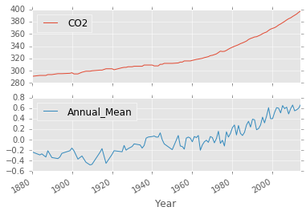
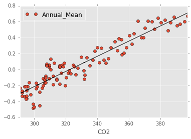

## Statistics and correlations

~~~
temp = pd.read_csv("../data/temperature.csv", index_col = "Year")

temp.index = temp.index.astype(float)
temp_comp = pd.concat((summary, temp["Annual_Mean"]), axis = 1)
temp_comp = temp_comp.dropna()
temp_comp[["CO2", "Annual_Mean"]].plot(subplots=True)
~~~
{: .python}

~~~
temp_comp.corr()
~~~
{: .python}

<table border="1" class="dataframe">
  <thead>
    <tr style="text-align: right;">
      <th></th>
      <th>CO2</th>
      <th>CH4</th>
      <th>N2O</th>
      <th>Annual_Mean</th>
    </tr>
  </thead>
  <tbody>
    <tr>
      <th>CO2</th>
      <td>1.000000</td>
      <td>0.962322</td>
      <td>0.997721</td>
      <td>0.936630</td>
    </tr>
    <tr>
      <th>CH4</th>
      <td>0.962322</td>
      <td>1.000000</td>
      <td>0.970145</td>
      <td>0.907395</td>
    </tr>
    <tr>
      <th>N2O</th>
      <td>0.997721</td>
      <td>0.970145</td>
      <td>1.000000</td>
      <td>0.936295</td>
    </tr>
    <tr>
      <th>Annual_Mean</th>
      <td>0.936630</td>
      <td>0.907395</td>
      <td>0.936295</td>
      <td>1.000000</td>
    </tr>
  </tbody>
</table>

~~~
temp_comp.cov()
~~~
{: .python}

<table border="1" class="dataframe">
  <thead>
    <tr style="text-align: right;">
      <th></th>
      <th>CO2</th>
      <th>CH4</th>
      <th>N2O</th>
      <th>Annual_Mean</th>
    </tr>
  </thead>
  <tbody>
    <tr>
      <th>CO2</th>
      <td>889.286382</td>
      <td>9798.345388</td>
      <td>427.067021</td>
      <td>8.440250</td>
    </tr>
    <tr>
      <th>CH4</th>
      <td>9798.345388</td>
      <td>116579.660104</td>
      <td>4754.600522</td>
      <td>93.621222</td>
    </tr>
    <tr>
      <th>N2O</th>
      <td>427.067021</td>
      <td>4754.600522</td>
      <td>206.030864</td>
      <td>4.061114</td>
    </tr>
    <tr>
      <th>Annual_Mean</th>
      <td>8.440250</td>
      <td>93.621222</td>
      <td>4.061114</td>
      <td>0.091313</td>
    </tr>
  </tbody>
</table>

~~~
model = pd.ols(y = temp_comp["Annual_Mean"], x = temp_comp["CO2"])
print(model.summary)
~~~
{: .python}

~~~
-------------------------Summary of Regression Analysis-------------------------

Formula: Y ~ <x> + <intercept>

Number of Observations:         103
Number of Degrees of Freedom:   2

R-squared:         0.8773
Adj R-squared:     0.8761

Rmse:              0.1064

F-stat (1, 101):   721.9861, p-value:     0.0000

Degrees of Freedom: model 1, resid 101

-----------------------Summary of Estimated Coefficients------------------------
      Variable       Coef    Std Err     t-stat    p-value    CI 2.5%   CI 97.5%
--------------------------------------------------------------------------------
             x     0.0095     0.0004      26.87     0.0000     0.0088     0.0102
     intercept    -3.0601     0.1167     -26.22     0.0000    -3.2888    -2.8314
---------------------------------End of Summary---------------------------------

/Users/josephmontoya/anaconda/envs/py35/lib/python3.5/site-packages/IPython/core/interactiveshell.py:2885: FutureWarning: The pandas.stats.ols module is deprecated and will be removed in a future version. We refer to external packages like statsmodels, see some examples here: http://statsmodels.sourceforge.net/stable/regression.html
  exec(code_obj, self.user_global_ns, self.user_ns)
~~~
{: .output}

* statsmodels module for OLS
* OLS regression requires a column for each fitted coefficient

~~~
import statsmodels.api as sm

xdata = temp_comp.CO2
xdata = sm.add_constant(xdata)
ydata = temp_comp.Annual_Mean
model = sm.OLS(ydata, xdata).fit()
model.summary()
~~~
{: .python}

<table class="simpletable">
<caption>OLS Regression Results</caption>
<tr>
  <th>Dep. Variable:</th>       <td>Annual_Mean</td>   <th>  R-squared:         </th> <td>   0.877</td>
</tr>
<tr>
  <th>Model:</th>                   <td>OLS</td>       <th>  Adj. R-squared:    </th> <td>   0.876</td>
</tr>
<tr>
  <th>Method:</th>             <td>Least Squares</td>  <th>  F-statistic:       </th> <td>   722.0</td>
</tr>
<tr>
  <th>Date:</th>             <td>Mon, 27 Jun 2016</td> <th>  Prob (F-statistic):</th> <td>8.27e-48</td>
</tr>
<tr>
  <th>Time:</th>                 <td>11:32:45</td>     <th>  Log-Likelihood:    </th> <td>  85.653</td>
</tr>
<tr>
  <th>No. Observations:</th>      <td>   103</td>      <th>  AIC:               </th> <td>  -167.3</td>
</tr>
<tr>
  <th>Df Residuals:</th>          <td>   101</td>      <th>  BIC:               </th> <td>  -162.0</td>
</tr>
<tr>
  <th>Df Model:</th>              <td>     1</td>      <th>                     </th>     <td> </td>   
</tr>
<tr>
  <th>Covariance Type:</th>      <td>nonrobust</td>    <th>                     </th>     <td> </td>   
</tr>
</table>
<table class="simpletable">
<tr>
    <td></td>       <th>coef</th>     <th>std err</th>      <th>t</th>      <th>P>|t|</th> <th>[95.0% Conf. Int.]</th> 
</tr>
<tr>
  <th>const</th> <td>   -3.0601</td> <td>    0.117</td> <td>  -26.222</td> <td> 0.000</td> <td>   -3.292    -2.829</td>
</tr>
<tr>
  <th>CO2</th>   <td>    0.0095</td> <td>    0.000</td> <td>   26.870</td> <td> 0.000</td> <td>    0.009     0.010</td>
</tr>
</table>
<table class="simpletable">
<tr>
  <th>Omnibus:</th>       <td> 0.451</td> <th>  Durbin-Watson:     </th> <td>   1.118</td>
</tr>
<tr>
  <th>Prob(Omnibus):</th> <td> 0.798</td> <th>  Jarque-Bera (JB):  </th> <td>   0.446</td>
</tr>
<tr>
  <th>Skew:</th>          <td>-0.152</td> <th>  Prob(JB):          </th> <td>   0.800</td>
</tr>
<tr>
  <th>Kurtosis:</th>      <td> 2.895</td> <th>  Cond. No.          </th> <td>3.68e+03</td>
</tr>
</table>

~~~
temp_comp.plot(y = "Annual_Mean", x = "CO2", linestyle = '', marker = 'o')
plt.plot(xdata, model.predict(xdata), 'k-')
~~~
{: .python}

## Exercise: Do a OLS regression on a 3-parameter quadratic model

~~~
xdata = temp_comp.CO2
xdata = sm.add_constant(xdata)
co2_squared = xdata.CO2**2
co2_squared.name = "CO2^2"
xdata = pd.concat((xdata, co2_squared), axis = 1)
fit = sm.OLS(temp_comp.Annual_Mean, xdata).fit()
print(fit.summary())
temp_comp.plot(y = "Annual_Mean", x = "CO2", linestyle = '', marker = 'o')
plt.plot(xdata, fit.predict(xdata), 'k-')
~~~
{: .python}

~~~
                        OLS Regression Results                            
 ==============================================================================
 Dep. Variable:            Annual_Mean   R-squared:                       0.878
 Model:                            OLS   Adj. R-squared:                  0.876
 Method:                 Least Squares   F-statistic:                     361.3
 Date:                Mon, 27 Jun 2016   Prob (F-statistic):           1.73e-46
 Time:                        09:45:42   Log-Likelihood:                 86.147
 No. Observations:                 103   AIC:                            -166.3
 Df Residuals:                     100   BIC:                            -158.4
 Df Model:                           2                                         
 Covariance Type:            nonrobust                                         
 ==============================================================================
             coef    std err          t      P>|t|      [95.0% Conf. Int.]
 ------------------------------------------------------------------------------
 const         -4.5277      1.499     -3.021      0.003        -7.502    -1.554
 CO2            0.0182      0.009      2.049      0.043         0.001     0.036
 CO2^2      -1.284e-05   1.31e-05     -0.982      0.328     -3.88e-05  1.31e-05
 ==============================================================================
 Omnibus:                        0.571   Durbin-Watson:                   1.130
 Prob(Omnibus):                  0.752   Jarque-Bera (JB):                0.584
 Skew:                          -0.173   Prob(JB):                        0.747
 Kurtosis:                       2.871   Cond. No.                     1.59e+07
 ==============================================================================
 
 Warnings:
 [1] Standard Errors assume that the covariance matrix of the errors is correctly specified.
 [2] The condition number is large, 1.59e+07. This might indicate that there are
 strong multicollinearity or other numerical problems.
~~~
{: .output}

